## Bootstrap的响应式布局 (Responsive Layout)

1. Grid System
2. .col-[SIZE]-[NUM]

### e.g. header

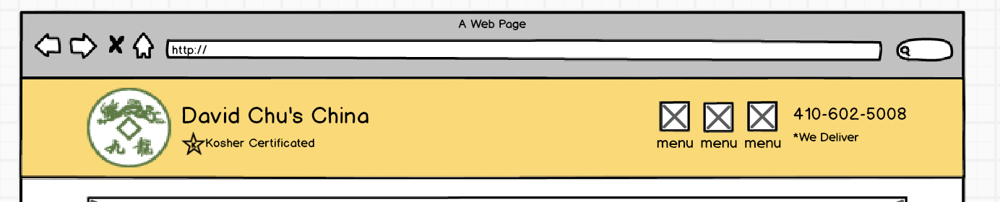

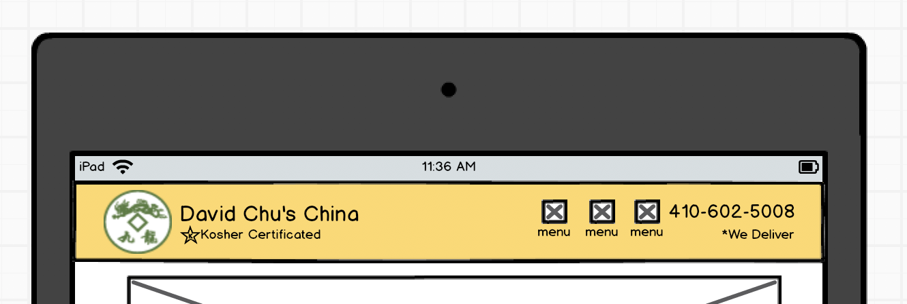

lg->md变化：Logo缩小

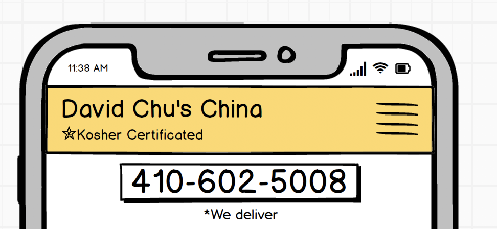

md->sm变化：
1. Logo隐藏，标题字体变大
2. 右侧按钮合并, 增加header下方的电话按钮

### e.g. home page

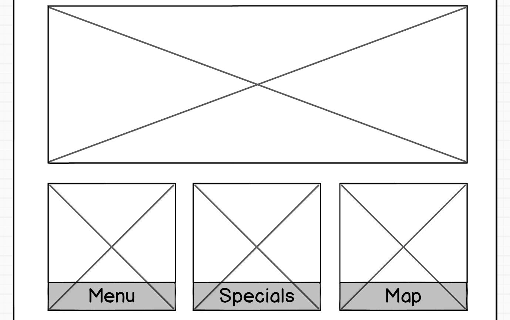

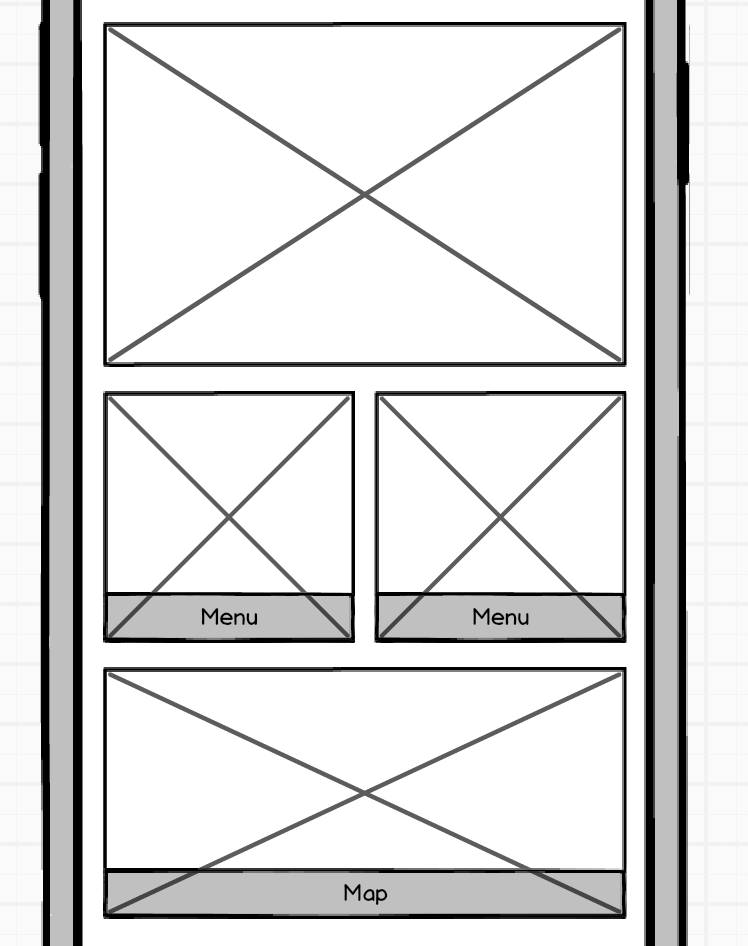

lg->md变化：Map放到第2行，占用12列

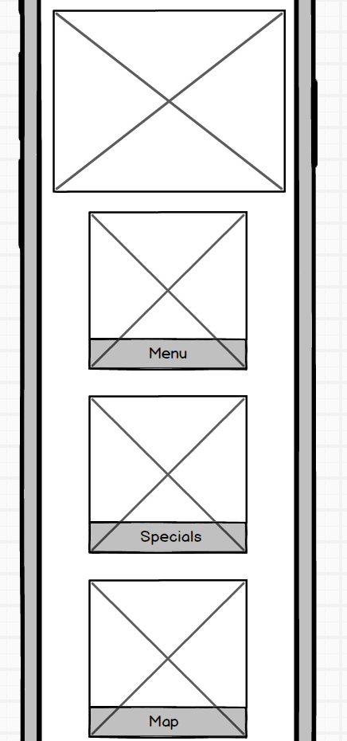

md->xs变化：每行1个Card

### e.g. footer

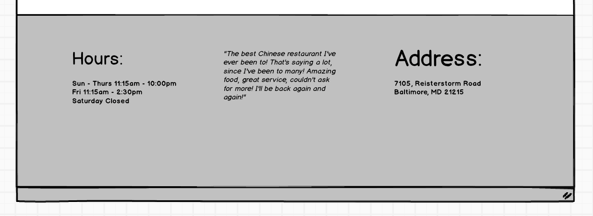

lg->md变化：每行1个条目，每个条目用分割线隔开

### e.g. single-category page

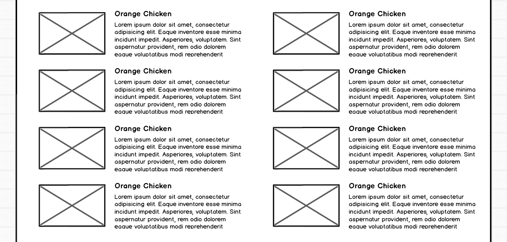

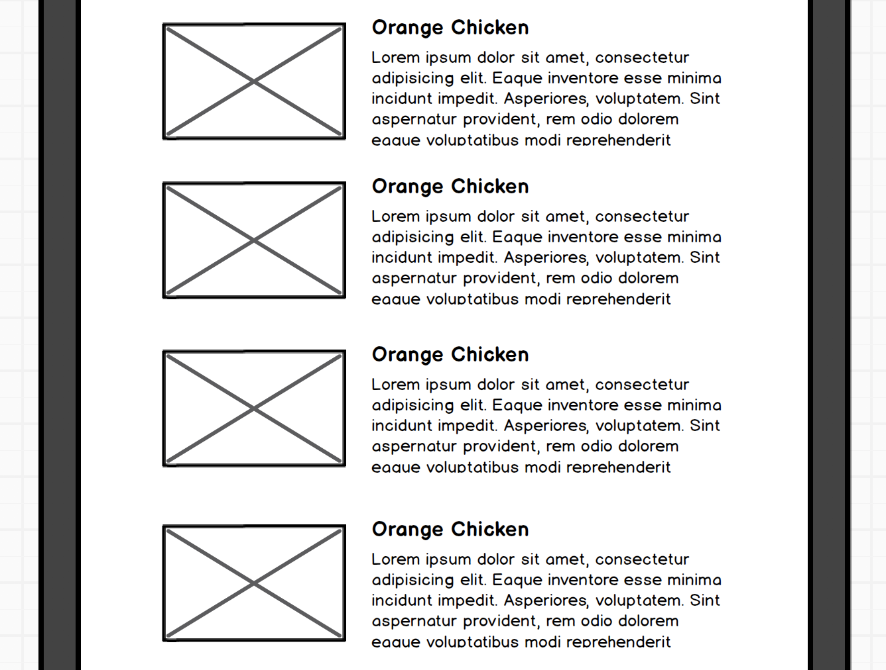

lg->md变化：每行1个条目

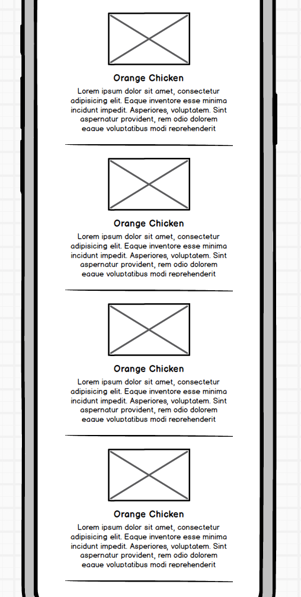

md->sm变化：图片与文字占用2行，居中，每个条目用分割线隔开

## 条目的文字长度

在single-category.html中，若D01的。menu-item-description过长，D03后面的条目位置都出现问题。

(由于bootstrap v3.3的grid system基于float实现才会出现该问题；而bootstrap v4.3的grid system基于flex实现，则不会出现该问题。)

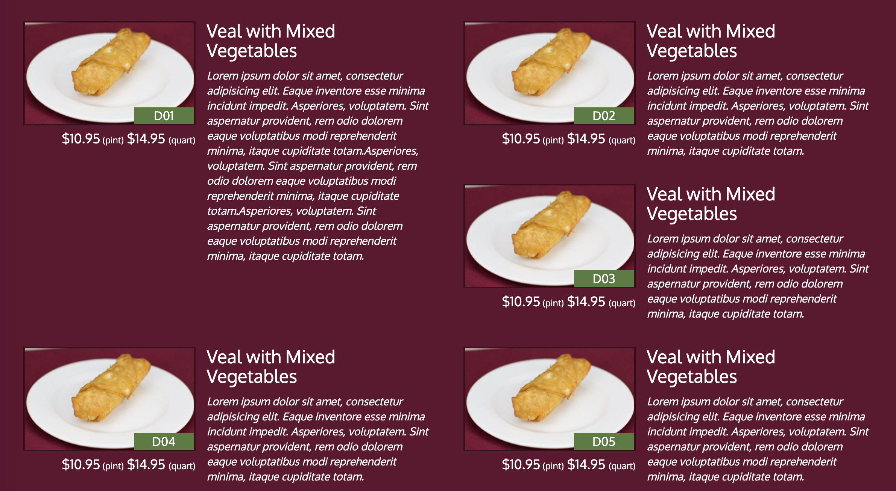

解决方法：
1. 设置overflow:hidden;
2. 每隔一个条目设置一次clear:left;
3. `

`

